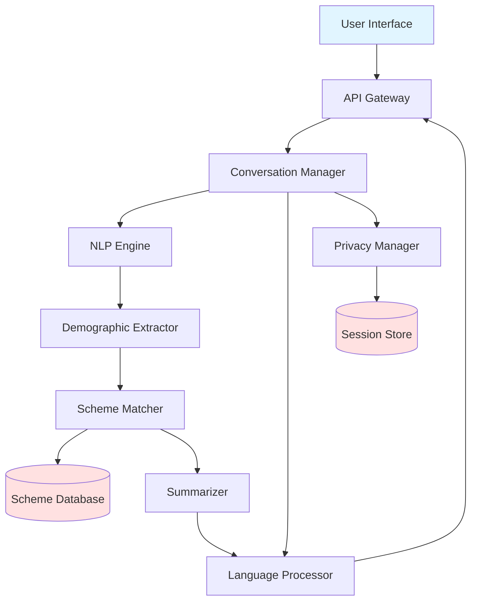

# Design Document: JanSahay AI Government Scheme Assistant

## Overview

JanSahay AI is an AI-powered conversational assistant that helps Indian citizens discover and understand government schemes they're eligible for. The system leverages Large Language Models (LLMs) and machine learning to understand natural language queries, extract demographic information through neural entity recognition, reason about eligibility using probabilistic matching, and generate personalized explanations in multiple languages.

At its core, JanSahay AI is an AI-assisted eligibility reasoning engine that combines:
- **LLM-based dialogue management** for natural conversation flow and intent understanding
- **Neural NER models** for demographic extraction with confidence scoring
- **Probabilistic ranking algorithms** for relevance-based scheme recommendation
- **Neural machine translation** for accurate multilingual support
- **AI-driven summarization** for generating accessible explanations

The architecture follows a cloud-native, microservices design with clear separation between conversation handling, AI inference, data extraction, scheme reasoning, and presentation layers. This enables independent scaling, testing, and updates to each component while supporting millions of concurrent users.

## Architecture

### High-Level Architecture



## AI Components

JanSahay AI is fundamentally an AI-driven system where machine learning and large language models power every aspect of user interaction and eligibility reasoning. This section describes the AI technologies that enable intelligent, contextual, and fair scheme recommendations.

### Large Language Models (LLMs)

**Intent Classification and Dialogue Management:**
- LLMs power the conversation engine, understanding user intent across diverse phrasings and contexts
- The system uses fine-tuned transformer models (e.g., GPT-based or BERT-based) to classify intents: query_schemes, provide_info, ask_details, modify_info
- Contextual understanding enables multi-turn conversations where the LLM maintains coherent dialogue state
- The LLM handles ambiguity resolution by generating contextually appropriate clarifying questions

**Summarization and Explanation Generation:**
- LLMs generate human-friendly scheme summaries from structured government data
- The system uses prompt engineering and fine-tuning to ensure:
  - Reading level appropriate for general audiences (grade 8 level)
  - Avoidance of bureaucratic jargon
  - Personalization based on user demographics
- Explanations are generated dynamically, highlighting benefits most relevant to each user's situation

**Reasoning and Explainability:**
- LLMs provide natural language explanations for why schemes match or don't match user profiles
- The system generates transparent reasoning: "This scheme matches because you are over 60 years old and have an annual income below ₹2 lakhs"
- Uncertainty is communicated naturally when confidence is low

### Named Entity Recognition (NER) Models

**Demographic Extraction:**
- Neural NER models extract demographic entities from unstructured text
- Custom-trained models recognize Indian-specific entities:
  - Age, income ranges, occupation types
  - Indian states, districts, and geographic identifiers
  - Caste categories, disability types, education levels
  - Family composition and household attributes

**Confidence Scoring:**
- Each extracted entity receives a probabilistic confidence score [0, 1]
- Low confidence triggers confirmation requests, ensuring accuracy
- The system learns from user corrections to improve extraction over time

**Contextual Aggregation:**
- NER models maintain entity resolution across conversation turns
- Coreference resolution links pronouns and references to previously mentioned entities
- Incremental profile building as users provide information naturally

### Probabilistic Relevance Ranking

**AI-Driven Scheme Matching:**
- Beyond rule-based eligibility checking, the system uses ML-based relevance scoring
- Ranking considers:
  - Exact eligibility match (binary rules)
  - Soft factors: user needs inferred from conversation, benefit magnitude, application complexity
  - Historical success rates (anonymized data on scheme uptake)
  - Contextual relevance based on user's expressed concerns

**Personalized Recommendations:**
- Machine learning models predict which schemes are most valuable to each user
- Features include: demographic profile, conversation context, expressed needs, geographic location
- Ranking is continuously refined based on user feedback and engagement patterns

**Near-Match Intelligence:**
- When exact matches are unavailable, AI identifies "close" schemes
- The system reasons about which eligibility criteria could be modified or which schemes might become available soon
- Provides actionable guidance: "You would qualify for this scheme if your income were ₹50,000 lower"

### Neural Machine Translation (NMT)

**Multilingual Support:**
- State-of-the-art neural translation models enable accurate multilingual interaction
- Supports: Hindi, English, Tamil, Telugu, Bengali, Marathi, Gujarati
- Models are fine-tuned on government domain terminology to preserve accuracy of:
  - Eligibility criteria (age limits, income thresholds)
  - Legal requirements and documentation
  - Application procedures

**Language Detection:**
- Automatic language identification using neural classifiers
- Handles code-switching (mixing languages within a sentence)
- Maintains language consistency throughout conversation

**Semantic Preservation:**
- Translation models are evaluated for semantic equivalence, not just fluency
- Critical information (numbers, dates, requirements) is validated post-translation
- Back-translation verification ensures eligibility criteria remain accurate

### Bias Monitoring and Fairness Evaluation

**Fairness-Aware AI:**
- Continuous monitoring for discriminatory patterns in scheme recommendations
- Statistical parity checks ensure protected attributes (caste, gender, religion, disability) don't unfairly influence recommendations
- Counterfactual fairness testing: profiles differing only in protected attributes should receive equivalent recommendations

**Bias Detection Mechanisms:**
- Automated audits compare recommendation distributions across demographic groups
- Anomaly detection identifies unexpected disparities in match rates
- Human-in-the-loop review for flagged cases

**Transparency and Accountability:**
- All AI decisions are logged (without PII) for fairness auditing
- Explanations are generated for every recommendation, enabling scrutiny
- Users can report biased or incorrect responses, triggering review

**Model Governance:**
- Regular retraining with diverse, representative data
- Adversarial testing to identify edge cases where bias might emerge
- Ethical AI guidelines enforced throughout model development and deployment


1. **User Input** → API Gateway receives natural language query
2. **Conversation Manager** maintains session context and routes requests
3. **Language Processor** uses neural translation models to detect input language and translate to internal format
4. **NLP Engine** uses LLM-based intent classification and neural NER for entity extraction
5. **Demographic Extractor** structures user information with ML-based confidence scoring
6. **Scheme Matcher** applies probabilistic eligibility reasoning and AI-driven relevance ranking
7. **Summarizer** uses LLM-based generation for simple language explanations
8. **Language Processor** translates output to user's language using neural MT
9. **Privacy Manager** ensures data handling compliance throughout

## Components and Interfaces

### 1. API Gateway

**Responsibility:** Entry point for all user requests, handles authentication, rate limiting, and request routing.

**Interface:**
```typescript
interface APIGateway {
  // Handle incoming user message
  processMessage(sessionId: string, message: string, metadata?: RequestMetadata): Promise<Response>
  
  // Start new conversation session
  createSession(userPreferences?: UserPreferences): Promise<SessionInfo>
  
  // End session and cleanup
  endSession(sessionId: string): Promise<void>
}

interface RequestMetadata {
  timestamp: Date
  clientInfo: string
  preferredLanguage?: string
}

interface Response {
  sessionId: string
  message: string
  language: string
  schemes?: SchemeCard[]
  needsMoreInfo?: string[]
}
```

### 2. Conversation Manager

**Responsibility:** Maintains conversation state, manages context across multiple turns, and orchestrates component interactions.

**Interface:**
```typescript
interface ConversationManager {
  // Process user message with context
  handleMessage(session: Session, message: string): Promise<ConversationResponse>
  
  // Update session context
  updateContext(sessionId: string, updates: ContextUpdate): Promise<void>
  
  // Get current conversation state
  getState(sessionId: string): Promise<ConversationState>
}

interface Session {
  id: string
  userId?: string
  demographics: DemographicProfile
  conversationHistory: Message[]
  language: string
  createdAt: Date
  lastActivity: Date
}

interface ConversationState {
  phase: 'greeting' | 'info_gathering' | 'matching' | 'details' | 'followup'
  missingInfo: string[]
  currentSchemes: string[]
  confidence: number
}
```

### 3. NLP Engine

**Responsibility:** Parse natural language input using LLMs for intent classification and neural NER models for entity extraction.

**Interface:**
```typescript
interface NLPEngine {
  // Parse user message and extract intent
  parseIntent(message: string, context: ConversationContext): Promise<Intent>
  
  // Extract named entities from text
  extractEntities(message: string): Promise<Entity[]>
  
  // Detect language of input text
  detectLanguage(message: string): Promise<LanguageCode>
}

interface Intent {
  type: 'query_schemes' | 'provide_info' | 'ask_details' | 'greeting' | 'modify_info'
  confidence: number
  entities: Entity[]
}

interface Entity {
  type: EntityType
  value: string
  normalizedValue: any
  confidence: number
  span: [number, number]
}

type EntityType = 
  | 'age' | 'income' | 'location' | 'occupation' 
  | 'gender' | 'disability' | 'education' | 'family_size'
  | 'caste_category'
```

### 4. Demographic Extractor

**Responsibility:** Structure extracted entities into a demographic profile with ML-based confidence tracking and contextual aggregation.

**Interface:**
```typescript
interface DemographicExtractor {
  // Build demographic profile from entities
  extractProfile(entities: Entity[], existingProfile?: DemographicProfile): Promise<DemographicProfile>
  
  // Identify missing critical information
  identifyGaps(profile: DemographicProfile): string[]
  
  // Validate and normalize demographic data
  normalizeProfile(profile: DemographicProfile): Promise<DemographicProfile>
}

interface DemographicProfile {
  age?: number
  ageConfidence?: number
  gender?: 'male' | 'female' | 'other'
  genderConfidence?: number
  income?: IncomeRange
  incomeConfidence?: number
  location?: Location
  locationConfidence?: number
  occupation?: string
  occupationConfidence?: number
  familySize?: number
  hasDisability?: boolean
  disabilityType?: string
  casteCategory?: 'general' | 'obc' | 'sc' | 'st'
  educationLevel?: string
  [key: string]: any
}

interface Location {
  state: string
  district?: string
  pincode?: string
  rural: boolean
}

interface IncomeRange {
  min: number
  max: number
  annual: boolean
}
```

### 5. Scheme Matcher

**Responsibility:** Match user demographics against scheme eligibility rules using probabilistic reasoning and rank results by relevance using AI-driven scoring.

**Interface:**
```typescript
interface SchemeMatcher {
  // Find all eligible schemes for a profile
  matchSchemes(profile: DemographicProfile): Promise<SchemeMatch[]>
  
  // Check if profile meets specific scheme criteria
  checkEligibility(schemeId: string, profile: DemographicProfile): Promise<EligibilityResult>
  
  // Rank schemes by relevance
  rankSchemes(matches: SchemeMatch[], profile: DemographicProfile): SchemeMatch[]
}

interface SchemeMatch {
  scheme: Scheme
  matchScore: number
  matchedCriteria: string[]
  unmatchedCriteria: string[]
  confidence: number
}

interface EligibilityResult {
  eligible: boolean
  matchedRules: Rule[]
  failedRules: Rule[]
  missingInfo: string[]
}

interface Scheme {
  id: string
  name: string
  nameTranslations: Record<LanguageCode, string>
  description: string
  descriptionTranslations: Record<LanguageCode, string>
  benefits: string[]
  eligibilityRules: Rule[]
  requiredDocuments: string[]
  applicationProcess: string
  level: 'central' | 'state' | 'district'
  state?: string
  district?: string
  active: boolean
  effectiveDate: Date
  expirationDate?: Date
}

interface Rule {
  field: string
  operator: 'eq' | 'gt' | 'lt' | 'gte' | 'lte' | 'in' | 'contains'
  value: any
  required: boolean
}
```

### 6. Summarizer

**Responsibility:** Generate simple, user-friendly explanations of schemes using LLM-based text generation and personalization.

**Interface:**
```typescript
interface Summarizer {
  // Generate brief scheme summary
  summarizeScheme(scheme: Scheme, profile: DemographicProfile): Promise<SchemeSummary>
  
  // Generate detailed scheme explanation
  explainScheme(scheme: Scheme, profile: DemographicProfile): Promise<SchemeExplanation>
  
  // Explain why scheme matches user
  explainMatch(match: SchemeMatch): Promise<string>
}

interface SchemeSummary {
  title: string
  briefDescription: string
  keyBenefits: string[]
  eligibilityHighlight: string
  nextSteps: string
  readingLevel: number
}

interface SchemeExplanation {
  summary: SchemeSummary
  fullDescription: string
  detailedBenefits: string[]
  eligibilityCriteria: string[]
  requiredDocuments: string[]
  applicationSteps: string[]
  contactInfo: string
  faqs: FAQ[]
}
```

### 7. Language Processor

**Responsibility:** Handle multilingual input/output using neural machine translation, language detection, and semantic preservation.

**Interface:**
```typescript
interface LanguageProcessor {
  // Detect language of text
  detectLanguage(text: string): Promise<LanguageCode>
  
  // Translate text to target language
  translate(text: string, targetLang: LanguageCode, sourceLang?: LanguageCode): Promise<string>
  
  // Translate structured content
  translateContent(content: any, targetLang: LanguageCode): Promise<any>
  
  // Get supported languages
  getSupportedLanguages(): LanguageCode[]
}

type LanguageCode = 'en' | 'hi' | 'ta' | 'te' | 'bn' | 'mr' | 'gu'
```

### 8. Privacy Manager

**Responsibility:** Ensure data privacy, manage consent, and handle data lifecycle.

**Interface:**
```typescript
interface PrivacyManager {
  // Create privacy-compliant session
  createSession(consent: ConsentInfo): Promise<string>
  
  // Store session data with encryption
  storeSessionData(sessionId: string, data: any): Promise<void>
  
  // Retrieve session data
  getSessionData(sessionId: string): Promise<any>
  
  // Delete session and all associated data
  deleteSession(sessionId: string): Promise<void>
  
  // Anonymize data for analytics
  anonymizeData(data: any): Promise<any>
  
  // Check if data retention period expired
  checkRetention(sessionId: string): Promise<boolean>
}

interface ConsentInfo {
  dataCollection: boolean
  analytics: boolean
  timestamp: Date
}
```

### 9. Scheme Database

**Responsibility:** Store and retrieve government scheme information with versioning.

**Interface:**
```typescript
interface SchemeDatabase {
  // Get scheme by ID
  getScheme(schemeId: string): Promise<Scheme | null>
  
  // Query schemes by criteria
  querySchemes(filters: SchemeFilters): Promise<Scheme[]>
  
  // Get all active schemes for a location
  getActiveSchemes(location: Location): Promise<Scheme[]>
  
  // Update scheme information
  updateScheme(schemeId: string, updates: Partial<Scheme>): Promise<void>
  
  // Add new scheme
  addScheme(scheme: Scheme): Promise<string>
  
  // Deactivate scheme
  deactivateScheme(schemeId: string): Promise<void>
}

interface SchemeFilters {
  level?: 'central' | 'state' | 'district'
  state?: string
  district?: string
  active?: boolean
  tags?: string[]
}
```

## Data Models

### Core Data Structures

**DemographicProfile:**
- Stores user demographic information with confidence scores
- All fields optional to support incremental information gathering
- Normalized formats for consistent matching

**Scheme:**
- Complete scheme information including multilingual content
- Rule-based eligibility criteria
- Metadata for filtering and versioning

**Session:**
- Temporary conversation state
- Automatically expires after inactivity
- Contains no PII after session ends

**SchemeMatch:**
- Links scheme to user with match quality metrics
- Explains which criteria matched/failed
- Enables transparent recommendations

### Data Flow

1. **Input Processing:** Raw text → Intent + Entities → DemographicProfile
2. **Matching:** DemographicProfile + Scheme Rules → SchemeMatch[]
3. **Presentation:** SchemeMatch + Language → Translated Summary
4. **Privacy:** All session data → Encrypted storage → Auto-deletion

## Scalability and Cloud Architecture

JanSahay AI is designed as a cloud-native, horizontally scalable system capable of serving millions of concurrent users across India. The architecture leverages modern cloud infrastructure and containerization to ensure high availability, performance, and cost efficiency.

### Cloud-Native Design

**Containerized Microservices:**
- Each component (NLP Engine, Scheme Matcher, Summarizer, etc.) is packaged as an independent Docker container
- Microservices communicate via REST APIs and message queues
- Independent deployment and versioning of each service
- Fault isolation: failures in one service don't cascade to others

**Orchestration:**
- Kubernetes manages container orchestration, auto-scaling, and self-healing
- Service mesh (e.g., Istio) handles inter-service communication, load balancing, and observability
- Rolling updates enable zero-downtime deployments

**Stateless Services:**
- Application services are stateless, storing session data in external stores
- Enables horizontal scaling by adding/removing instances dynamically
- Load balancers distribute traffic across service instances

### Horizontal Scaling

**Auto-Scaling Policies:**
- CPU and memory-based auto-scaling for compute-intensive services (NLP Engine, Summarizer)
- Request rate-based scaling for API Gateway and Conversation Manager
- Predictive scaling based on historical traffic patterns (peak hours, campaign launches)

**Component-Specific Scaling:**
- **NLP Engine & LLM Services:** GPU-accelerated instances for inference, scaled based on request queue depth
- **Scheme Matcher:** CPU-optimized instances, scaled based on matching request volume
- **Language Processor:** Separate scaling for translation services, supporting burst traffic in specific languages
- **Database:** Read replicas for scheme database, sharded session store for write scalability

**Geographic Distribution:**
- Multi-region deployment for low latency across India
- Content Delivery Network (CDN) for static assets
- Regional data residency compliance where required

### AWS Infrastructure Suitability

**Recommended AWS Services:**
- **Compute:** ECS/EKS for container orchestration, Lambda for event-driven functions
- **AI/ML:** SageMaker for model hosting and inference, Bedrock for LLM access
- **Storage:** S3 for scheme data and model artifacts, DynamoDB for session store, RDS for scheme database
- **Networking:** ALB/NLB for load balancing, API Gateway for API management, CloudFront for CDN
- **Security:** KMS for encryption, Secrets Manager for credentials, WAF for protection
- **Monitoring:** CloudWatch for metrics and logs, X-Ray for distributed tracing

**Cost Optimization:**
- Spot instances for non-critical batch processing
- Reserved instances for baseline capacity
- Auto-scaling to match demand, avoiding over-provisioning
- Efficient model serving with batching and caching

**High Availability:**
- Multi-AZ deployment for fault tolerance
- Automated backups and disaster recovery
- Health checks and automatic instance replacement
- Circuit breakers and retry logic for resilience

### Performance at Scale

**Millions of Users:**
- Architecture supports 10M+ daily active users
- Sub-2-second response times even under peak load
- Efficient caching strategies:
  - Scheme data cached at CDN and application layers
  - LLM responses cached for common queries
  - Translation cache for frequently requested content

**Database Optimization:**
- Indexed queries for fast scheme retrieval
- Materialized views for complex eligibility queries
- Connection pooling to handle high concurrency
- Read-heavy workload optimized with replicas

**AI Inference Optimization:**
- Model quantization for faster inference
- Batch inference where latency permits
- Model caching to avoid repeated loading
- GPU sharing for cost-efficient LLM serving

### Monitoring and Observability

**Real-Time Metrics:**
- Request rates, latency percentiles (p50, p95, p99)
- Error rates by service and endpoint
- AI model inference times and accuracy metrics
- Resource utilization (CPU, memory, GPU)

**Distributed Tracing:**
- End-to-end request tracing across microservices
- Identification of bottlenecks and slow components
- Correlation of errors across service boundaries

**Alerting:**
- Automated alerts for SLA violations, error spikes, resource exhaustion
- On-call rotation for incident response
- Runbooks for common failure scenarios

### Security and Compliance

**Data Protection:**
- Encryption in transit (TLS 1.3) and at rest (AES-256)
- Network isolation with VPCs and security groups
- Secrets management for API keys and credentials

**Compliance:**
- GDPR and Indian data protection compliance
- Audit logging for all data access
- Regular security assessments and penetration testing

**DDoS Protection:**
- Rate limiting at API Gateway
- WAF rules to block malicious traffic
- Auto-scaling to absorb traffic spikes


### Error Categories

1. **Input Errors:**
   - Unrecognized language → Prompt for supported language
   - Ambiguous input → Ask clarifying questions
   - Invalid data → Request correction with examples

2. **System Errors:**
   - NLP service failure → Fallback to keyword matching
   - Database unavailable → Return cached schemes with warning
   - Translation service down → Respond in English with apology

3. **Data Errors:**
   - Missing critical demographics → Identify gaps and request info
   - Conflicting information → Highlight conflict and ask for clarification
   - No matching schemes → Suggest nearby matches or alternative resources

### Error Response Strategy

```typescript
interface ErrorResponse {
  type: 'input_error' | 'system_error' | 'data_error'
  message: string
  userMessage: string
  suggestions: string[]
  fallbackAction?: string
}
```

**Principles:**
- Never expose technical details to users
- Always provide actionable next steps
- Maintain conversation context even after errors
- Log errors for monitoring without storing PII

## Testing Strategy

### Unit Testing

Unit tests will verify specific examples, edge cases, and error conditions for individual components:

- **NLP Engine:** Test entity extraction with various phrasings, misspellings, and edge cases
- **Demographic Extractor:** Test confidence scoring, normalization, and gap identification
- **Scheme Matcher:** Test specific eligibility scenarios and edge cases
- **Summarizer:** Test reading level, clarity, and completeness of summaries
- **Privacy Manager:** Test encryption, deletion, and anonymization functions
- **Language Processor:** Test translation accuracy for key terms and phrases

### Property-Based Testing

Property-based tests will verify universal correctness properties across all inputs using a PBT library (fast-check for TypeScript/JavaScript). Each test will run a minimum of 100 iterations with randomized inputs.

Tests will be tagged with: **Feature: jansahay-ai-assistant, Property {N}: {property_text}**


## Correctness Properties

*A property is a characteristic or behavior that should hold true across all valid executions of a system—essentially, a formal statement about what the system should do. Properties serve as the bridge between human-readable specifications and machine-verifiable correctness guarantees.*

### Property Reflection

After analyzing all acceptance criteria, I identified several areas where properties can be consolidated:

- Entity extraction (1.2) and demographic structuring (2.1) can be combined into a single comprehensive extraction property
- Confidence scoring (2.2) and confidence-based confirmation (2.3) can be tested together
- Language detection (5.2) and response language matching (5.3) are closely related and can be combined
- Session data deletion (6.2) and PII non-retention (6.1) both test data lifecycle and can be unified
- Multiple properties about scheme matching completeness (3.1, 3.4) can be consolidated

### Properties

**Property 1: Intent Classification Correctness**
*For any* natural language query with a known intent, the NLP_Engine should correctly identify the intent type with appropriate confidence scoring.
**Validates: Requirements 1.1**

**Property 2: Demographic Entity Extraction and Structuring**
*For any* text containing demographic information, the system should extract all mentioned demographic attributes and structure them into a DemographicProfile with valid confidence scores between 0 and 1.
**Validates: Requirements 1.2, 2.1, 2.2**

**Property 3: Information Gap Detection**
*For any* DemographicProfile with missing required fields, the system should identify all missing information needed for scheme matching.
**Validates: Requirements 1.3**

**Property 4: Multiple Intent Handling**
*For any* query containing multiple intents, the NLP_Engine should identify all distinct intents present in the query.
**Validates: Requirements 1.4**

**Property 5: Low Confidence Triggers Confirmation**
*For any* extracted demographic attribute with confidence below the threshold (0.7), the system should request user confirmation before using that attribute for matching.
**Validates: Requirements 2.3**

**Property 6: Demographic Data Normalization**
*For any* extracted demographic data, the normalized output should follow standardized formats (income as ranges, locations as structured objects, ages as integers).
**Validates: Requirements 2.4**

**Property 7: Context Aggregation Across Messages**
*For any* sequence of messages containing partial demographic information, the system should aggregate all information into a single DemographicProfile without losing previously provided data.
**Validates: Requirements 2.5**

**Property 8: Eligibility Matching Correctness**
*For any* DemographicProfile and Scheme with explicit eligibility rules, the matcher should return eligible=true if and only if all required rules are satisfied by the profile.
**Validates: Requirements 3.1, 3.4**

**Property 9: Scheme Ranking Produces Valid Ordering**
*For any* set of matched schemes, the ranking should produce a total ordering where schemes with higher match scores appear before schemes with lower match scores.
**Validates: Requirements 3.2**

**Property 10: Near-Match Identification**
*For any* DemographicProfile that doesn't exactly match any scheme, the system should identify schemes where the profile fails only a subset of non-required criteria.
**Validates: Requirements 3.3**

**Property 11: Active Schemes Only**
*For any* scheme matching operation, only schemes with active=true and current date within [effectiveDate, expirationDate] should be included in results.
**Validates: Requirements 3.5**

**Property 12: Summary Completeness**
*For any* scheme, the generated summary should include all required fields: scheme name, key benefits, eligibility criteria, required documents, and application process.
**Validates: Requirements 4.1**

**Property 13: Reading Level Compliance**
*For any* generated summary text, the Flesch-Kincaid reading level should be at or below grade 8.
**Validates: Requirements 4.2**

**Property 14: Jargon Avoidance**
*For any* generated summary, the text should not contain terms from a predefined jargon list without accompanying explanations.
**Validates: Requirements 4.3**

**Property 15: Brief and Detailed Views**
*For any* scheme with description length exceeding 500 characters, the system should provide both a brief summary (under 200 characters) and a detailed explanation.
**Validates: Requirements 4.4**

**Property 16: Benefit Relevance**
*For any* scheme summary generated for a specific user profile, highlighted benefits should relate to at least one demographic attribute in the profile.
**Validates: Requirements 4.5**

**Property 17: Language Detection and Response Consistency**
*For any* user input in a supported language, the system should detect the language correctly and respond in the same language.
**Validates: Requirements 5.2, 5.3**

**Property 18: Language Switch Honored**
*For any* explicit language change request, all subsequent responses in the session should use the newly requested language.
**Validates: Requirements 5.4**

**Property 19: Translation Preserves Eligibility Semantics**
*For any* scheme eligibility criteria, translating to another supported language and back to the original should preserve the logical meaning of the criteria.
**Validates: Requirements 5.5**

**Property 20: Session Data Deletion**
*For any* session that has ended, querying for that session's demographic data and conversation history should return null or empty results.
**Validates: Requirements 6.1, 6.2**

**Property 21: Anonymization Removes PII**
*For any* data passed through the anonymization function, the output should not contain personally identifiable information (names, exact ages, precise locations, income values).
**Validates: Requirements 6.5**

**Property 22: Non-Discrimination on Protected Attributes**
*For any* two DemographicProfiles that differ only in protected attributes (caste, religion, gender, disability) but are otherwise identical, the matched schemes should be the same.
**Validates: Requirements 7.1**

**Property 23: Match Explanations Present**
*For any* SchemeMatch result, the match should include non-empty lists of matchedCriteria explaining why the scheme was selected.
**Validates: Requirements 7.2**

**Property 24: Uncertainty Communication**
*For any* response with overall confidence below 0.6, the response message should include explicit uncertainty indicators (phrases like "I'm not certain" or "This might be").
**Validates: Requirements 7.4**

**Property 25: Audit Log Creation**
*For any* scheme matching operation, an audit log entry should be created containing the operation type, timestamp, and anonymized decision factors (without PII).
**Validates: Requirements 7.5**

**Property 26: Conversation Context Preservation**
*For any* sequence of messages in a session, information from earlier messages should remain accessible in later conversation states.
**Validates: Requirements 8.1**

**Property 27: Detail Request Returns Complete Information**
*For any* request for scheme details with a valid scheme ID, the response should include the complete SchemeExplanation with all fields populated.
**Validates: Requirements 8.2**

**Property 28: Profile Update Triggers Re-matching**
*For any* demographic profile update in an active session, the system should re-run scheme matching and update the current scheme recommendations.
**Validates: Requirements 8.3**

**Property 29: Common Conversation Patterns Handled**
*For any* input matching common conversation patterns (greetings like "hello", "hi", "namaste"), the system should respond appropriately without treating them as scheme queries.
**Validates: Requirements 8.4**

**Property 30: Long Conversation Reset Offer**
*For any* conversation with more than 20 message exchanges, the system should offer to start fresh with a summary of current understanding.
**Validates: Requirements 8.5**

**Property 31: Low Confidence Triggers Clarification**
*For any* parsed query with intent confidence below 0.5, the system should ask clarifying questions rather than proceeding with uncertain interpretation.
**Validates: Requirements 9.1**

**Property 32: Zero Matches Provides Guidance**
*For any* demographic profile that produces zero scheme matches, the response should include guidance on alternative resources or suggestions for nearby eligibility.
**Validates: Requirements 9.2**

**Property 33: Technical Errors Produce User-Friendly Messages**
*For any* system error or exception, the error response to the user should not contain technical stack traces or error codes, only user-friendly explanations.
**Validates: Requirements 9.3**

**Property 34: Unsupported Language Handling**
*For any* input in an unsupported language, the system should respond with a message listing available language options.
**Validates: Requirements 9.4**

**Property 35: Scheme Schema Compliance**
*For any* scheme in the database, it should conform to the Scheme interface with all required fields present and properly typed.
**Validates: Requirements 10.1**

**Property 36: Scheme Update Immediate Availability**
*For any* scheme update operation, querying for that scheme immediately after the update should return the updated information.
**Validates: Requirements 10.2**

**Property 37: Scheme Metadata Completeness**
*For any* scheme in the database, it should have all required metadata fields: effectiveDate, level, active status, and geographic applicability (state/district if not central).
**Validates: Requirements 10.3**

**Property 38: Multi-Level Scheme Support**
*For any* location (state and district), the system should be able to retrieve and match schemes at central, state, and district levels.
**Validates: Requirements 10.4**

**Property 39: Inactive Schemes Not Recommended**
*For any* scheme with active=false, it should never appear in matching results regardless of eligibility.
**Validates: Requirements 10.5**


## Testing Strategy

### Overview

The testing strategy employs a dual approach combining unit tests for specific scenarios and property-based tests for universal correctness guarantees. This ensures both concrete bug detection and comprehensive input coverage.

### Property-Based Testing

**Library:** fast-check (for TypeScript/JavaScript implementation)

**Configuration:**
- Minimum 100 iterations per property test
- Each test tagged with: **Feature: jansahay-ai-assistant, Property {N}: {property_text}**
- Each correctness property from the design document implemented as a single property-based test

**Property Test Coverage:**
- All 39 correctness properties will be implemented as property-based tests
- Tests will use generators for: DemographicProfiles, Schemes, Messages, Sessions, Rules
- Generators will produce edge cases: empty values, boundary conditions, extreme values
- Shrinking enabled to find minimal failing examples

**Example Property Test Structure:**
```typescript
// Feature: jansahay-ai-assistant, Property 8: Eligibility Matching Correctness
test('eligibility matching correctness', () => {
  fc.assert(
    fc.property(
      demographicProfileArbitrary(),
      schemeWithRulesArbitrary(),
      (profile, scheme) => {
        const result = schemeMatcher.checkEligibility(scheme.id, profile);
        const manualCheck = evaluateRulesManually(scheme.eligibilityRules, profile);
        expect(result.eligible).toBe(manualCheck);
      }
    ),
    { numRuns: 100 }
  );
});
```

### Unit Testing

**Focus Areas:**
- Specific examples demonstrating correct behavior
- Edge cases: empty inputs, null values, boundary conditions
- Error conditions: invalid data, service failures, timeouts
- Integration points: API contracts, database queries, external services

**Unit Test Coverage:**
- NLP Engine: Test specific phrases, misspellings, ambiguous queries
- Demographic Extractor: Test edge cases like age=0, negative income, unknown locations
- Scheme Matcher: Test specific eligibility scenarios (e.g., senior citizen schemes, disability benefits)
- Summarizer: Test specific schemes with known good summaries
- Privacy Manager: Test encryption, session lifecycle, consent handling
- Language Processor: Test specific translations for accuracy

**Balance:**
- Avoid excessive unit tests for scenarios covered by property tests
- Focus unit tests on integration, examples, and specific edge cases
- Use property tests for comprehensive input coverage

### Integration Testing

**Scope:**
- End-to-end conversation flows
- Multi-turn conversations with context
- Language switching mid-conversation
- Error recovery scenarios
- Database integration
- External service integration (translation APIs, NLP services)

**Test Scenarios:**
- Complete user journey: greeting → info gathering → matching → details → application
- Privacy compliance: session creation → data collection → session end → data deletion
- Multilingual flow: Hindi input → scheme matching → Hindi output
- Error handling: service failure → fallback → recovery

### Performance Testing

**Metrics:**
- Response time: < 2 seconds for scheme matching
- Throughput: Support 100 concurrent sessions
- Database query time: < 100ms for scheme retrieval
- Translation time: < 500ms per response

**Load Testing:**
- Simulate 1000 concurrent users
- Test session cleanup under load
- Verify no memory leaks during extended sessions

### Security Testing

**Focus:**
- Input validation: SQL injection, XSS, command injection attempts
- Authentication and authorization
- Data encryption verification
- Privacy compliance: PII handling, data retention
- Rate limiting and DoS protection

### Accessibility Testing

**Requirements:**
- Screen reader compatibility for web interface
- Keyboard navigation support
- Clear error messages for assistive technologies
- Language support for diverse user base

### Monitoring and Observability

**Metrics to Track:**
- Intent classification accuracy
- Entity extraction accuracy
- Scheme matching precision and recall
- User satisfaction (explicit feedback)
- Session completion rates
- Error rates by component
- Response times by operation

**Logging:**
- Audit logs for all matching decisions (anonymized)
- Error logs with context (no PII)
- Performance metrics
- Usage patterns (anonymized)

### Continuous Testing

**CI/CD Integration:**
- All property tests run on every commit
- Unit tests run on every commit
- Integration tests run on merge to main
- Performance tests run nightly
- Security scans run weekly

**Quality Gates:**
- 100% of property tests must pass
- 95% unit test coverage for core components
- No high-severity security vulnerabilities
- Response time within SLA

